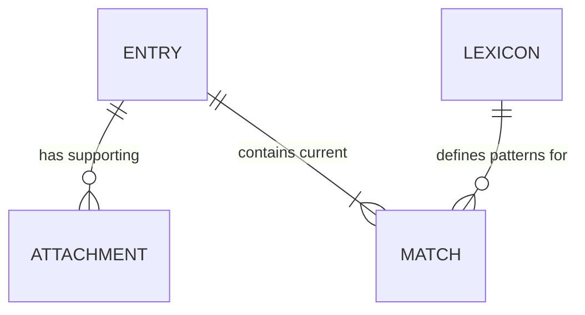
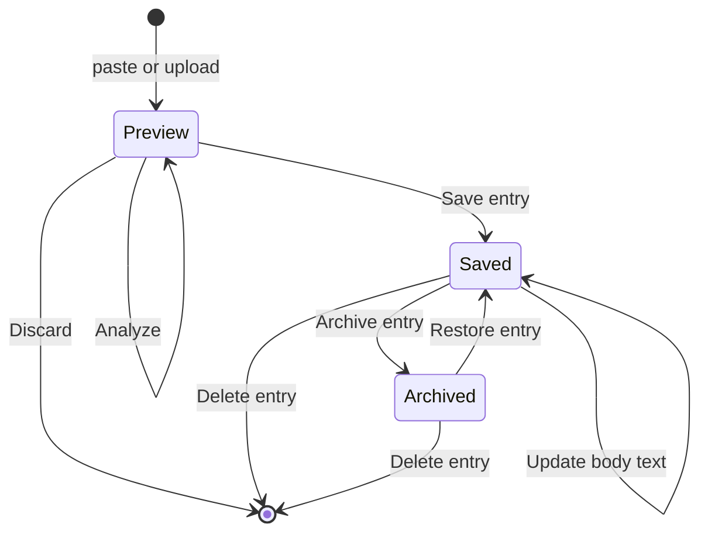
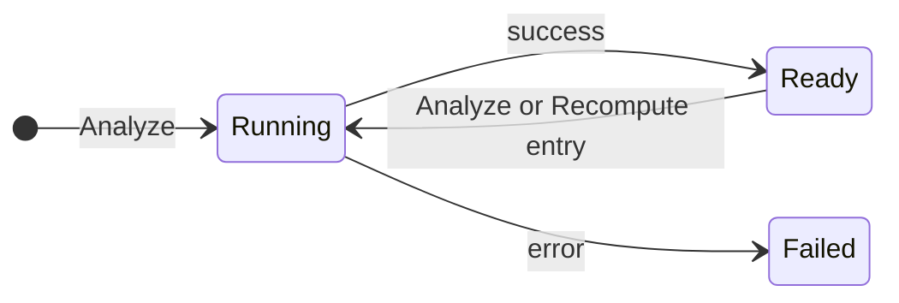

# Conceptual model — Gender research app (personal)

*Updated with scoring rules, lexicon, and temporal decisions (no analysis snapshots).*

---

## Resolved decisions

| Topic | Decision |
|-------|----------|
| **% denominator** | Masculine % and feminine % are each **count ÷ total word count**, where total = **all words** in body text (tokenization rule: engineering) |
| **Metrics shown** | **Masculine %** and **feminine %** only — no neutral/unmatched % |
| **Matching** | **Case-insensitive**; patterns with trailing `*` are **prefix** matches (any letters, hyphens, digits after) |
| **Lexicon** | **One editable list** (masculine column + feminine column) — no versions, no publish step |
| **Saved entries & lexicon** | Scores are **live**, not snapshotted. **Recompute entry** re-runs against the **current** Lexicon and **overwrites** counts, %, and matches on that Entry |
| **Lexicon change** | Does not auto-update all Entries; stale until user **Recompute entry** (bulk recompute optional later) |
| **Overlapping patterns** | **Longest match wins** when multiple patterns could match the same span |
| **Tokenization** | Words may include **hyphens**; full rules can be refined later in implementation |
| **Ingest — body text** | **Paste only** — user supplies JD text for analysis |
| **Ingest — PDF** | **Upload only** — stored as **Attachment** for posterity; **not parsed**; **Download attachment** to view again |

Seed data: [`data/lexicon.seed.json`](../../data/lexicon.seed.json)

---

## Phase 1 — Scope

| Question | Answer |
|----------|--------|
| **Product** | Solo personal app for researching gendered language in job descriptions |
| **Core job** | Paste or upload JD text → **Analyze** → formatted body with masculine/feminine highlights + % → **Save entry** with provenance |
| **Material** | Brief, orient session, designer rules above |

---

## Matching rules (domain → product)

These are **product behaviour**, not implementation detail:

1. **Tokenization:** Split body text into words for **total word count** and scanning. **Hyphens are allowed inside words** (e.g. `self-confident`); finer rules may be refined later.
2. **Patterns:** Each Lexicon row is either a **literal** (e.g. `Decide`) or a **prefix pattern** ending in `*` (e.g. `Aggress*` → matches `aggressive`, `aggression`, …).
3. **Case:** Compare case-insensitively.
4. **Overlap:** When multiple patterns match the same span, **longest match wins** (length = matched character span in body text).
5. **Counts for %:** Count **matched tokens** (each occurrence counts). Masculine % = masculine match count ÷ total words; feminine % = feminine match count ÷ total words.
6. **Highlights:** Every counted occurrence appears in the formatted view with category styling.

**Ingest (separate paths)**

| Path | Purpose |
|------|---------|
| **Paste** | Sole source of **body text** for **Analyze** / matching |
| **Upload (PDF)** | Creates **Attachment** only — no text extraction, no analysis from file |

---

## Phase 2 — Objects

| Object | Role |
|--------|------|
| **Entry** | Saved (or preview) job description + current analysis results + metadata |
| **Lexicon** | Global singleton: editable masculine/feminine pattern lists |
| **Attachment** | Optional PDF/file on an Entry |
| **Match** | Embedded hit (offset, text, category) — not user-navigable |

**Removed:** Analysis snapshot, lexicon versioning, Publish lexicon version.

---

## Phase 3 — Object definitions

### Entry

**What it is:** One job description in her research corpus, with **current** scores and highlights derived from the **current** Lexicon whenever **Analyze** or **Recompute entry** runs.

**Attributes**

| Attribute | Notes |
|-----------|--------|
| Title, Company, Notes | Optional metadata |
| Body text | Source for matching |
| Source URL | e.g. LinkedIn |
| Captured date | User-facing date for the research record |
| Total word count | Set on last analyze |
| Masculine count, Feminine count | Set on last analyze |
| Masculine %, Feminine % | Derived from counts ÷ total words |
| Matches | List of **Match** (for highlights) |
| Last analyzed at | When matching last ran |
| Created at / Updated at | System |

**Relationships**

| To | Cardinality | Role |
|----|-------------|------|
| Attachment | `o{` zero or many | Supporting files |

*No persisted link to a lexicon version — always uses Lexicon **as it exists now** when analyzing/recomputing.*

**Actions**

| Verb | Meaning |
|------|---------|
| **Analyze** | Run matching (Preview, or refresh results before first save) |
| **Save entry** | Move from Preview to Saved; persist body, results, metadata |
| **Open entry** | View formatted body, highlights, %, metadata |
| **Recompute entry** | Re-run matching on Saved Entry; **overwrite** counts, %, matches |
| **Update metadata** | Title, company, notes, URL, captured date |
| **Update body text** | Change pasted JD text (Saved); user should **Recompute entry** (prompt if stale) |
| **Attach file** | Upload PDF (or other file) — stored only, not parsed |
| **Download attachment** | Open/save the uploaded file again |
| **Remove attachment** | Delete file from Entry |
| **Archive entry** / **Restore entry** / **Delete entry** | Corpus management |

---

### Match (embedded)

| Attribute | Notes |
|-----------|--------|
| Matched text | As found in body |
| Category | `masculine` \| `feminine` |
| Start / end offset | For highlights |
| Pattern | Lexicon row that matched (for debugging/transparency) |

---

### Lexicon (singleton)

**What it is:** The one masculine/feminine word list she maintains.

**Attributes:** `masculine_patterns[]`, `feminine_patterns[]`, `updated_at`

**Actions**

| Verb | Meaning |
|------|---------|
| **Edit lexicon** | Add, remove, or change rows in either column |
| **Import lexicon** | Replace from file (optional v1) |
| **Reset lexicon** | Restore seed list (optional safety) |

**Effect on Entries:** Editing Lexicon does **not** change saved % until each Entry is **Recomputed** (or user runs a future “Recompute all”).

---

### Attachment

**What it is:** A file the user uploaded alongside an Entry (typically PDF of the posting). **Not** a source for analysis.

**Attributes:** file name, file type, uploaded at, stored blob reference

**Actions:** **Attach file**, **Download attachment**, **Remove attachment**

**Rule:** Analysis always runs on **pasted body text** only. PDF is optional provenance.

---

## Phase 4 — Object map

**Reading:** **Lexicon** is global. **Entry** holds the **current** set of **Matches** and scores from the last **Analyze** / **Recompute entry**. No frozen snapshot entity.

---

## Phase 5 — States & temporal

### Entry

| State | Notes |
|-------|--------|
| **Preview** | Not in corpus; **Analyze** updates highlights in place |
| **Saved** | **Recompute entry** overwrites results; no historical scores kept |
| **Stale** (UX flag, not stored state) | Body or Lexicon changed since `last_analyzed_at` — show banner “Recompute to refresh scores” |

**Temporal**

| Topic | Decision |
|-------|----------|
| **History** | No score history; only latest analysis on Entry |
| **Lexicon edit** | Forward-only; past % not preserved |
| **Deletion** | **Delete entry** = permanent |

### Lexicon

Single state: **Active** (always editable). No version lifecycle.

### Analyze (transient)

---

## Highlighted formatted view

Renders **body text** + **Matches** (masculine / feminine styles). Same component in Preview and Saved. After **Recompute entry**, highlights and % replace previous values.

---

## Phase 6 — Ubiquitous language

### Nouns

| Term | Notes |
|------|--------|
| **Entry** | Research record |
| **Lexicon** | Masculine/feminine pattern lists (UI may label “Word list”) |
| **Match** | Highlighted hit |
| **Masculine % / Feminine %** | Only two metrics |

**Retired:** Analysis snapshot, Publish lexicon version

### Verbs

| Verb | When |
|------|------|
| **Analyze** | Preview (and optionally first pass after body edit) |
| **Recompute entry** | Saved Entry — refresh scores from current Lexicon |
| **Save entry** | Preview → Saved |
| **Edit lexicon** | Change global patterns |
| **Update metadata** / **Update body text** | Saved Entry |

---

## Open questions (remaining)

| # | Question |
|---|----------|
| 1 | **Export** — CSV/report for external research |
| 2 | **Compare** two Entries side-by-side |
| 3 | **Captured date** — auto vs editable on save |
| 4 | **Bulk recompute** after lexicon edit — offer “Update all entries”? |
| 5 | **Tokenization refinements** — apostrophes, numbers, punctuation edges (hyphens settled) |

---

## Next

**`/layers-interaction-flow`** — Preview vs Saved places, recompute/stale UX, lexicon editor, corpus list.
