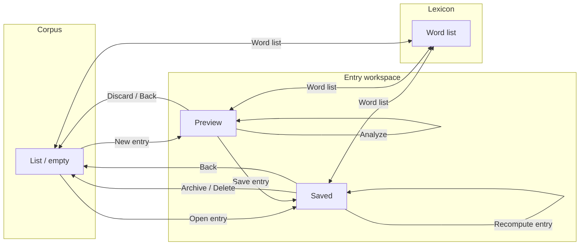

# Interaction flow — Gender research app

*Breadboarding from [`conceptual-model.md`](conceptual-model.md). Primary method: Ryan Singer breadboards.*

---

## CUJ 1 — Analyze and save a job description (primary)

### Job story

**When** I find a job posting I want to study,  
**I want to** paste the description, see masculine/feminine words highlighted with percentages, and save a research record with date, link, and an optional PDF of the page,  
**so that** I can build a personal corpus for my gendered-language research.

**Start:** App open, often on **Corpus** (or deep link to **New entry**).  
**Success:** A **Saved** Entry exists in **Corpus** with scores, highlights, metadata, and optional **Attachment**.

---

### Places (3 core + 1 secondary)

| Place | Role |
|-------|------|
| **Corpus** | Home — browse, search/filter, start new work |
| **Entry workspace** | One place, two modes: **Preview** (unsaved) and **Saved** — all Entry attributes and actions together |
| **Lexicon** | Edit global word list (secondary CUJ) |

*Collapsed Preview vs Entry detail into **Entry workspace** to avoid broken Entry object and stay under six places.*

---

### Breadboard — Corpus

```
Corpus
- New entry → Entry workspace (Preview mode)
- Open entry → Entry workspace (Saved mode)
- Word list → Lexicon
- Show archived (toggle) → Corpus (archived filter on)
- Restore entry [archived row only] → Corpus (active filter)
[ Content ]
- Page title: research app name / “Entries”
- Primary CTA: New entry
- List: each Entry — title or first line, company (if any), captured date, masculine %, feminine %
- Optional: stale indicator on row if lexicon changed since entry’s last_analyzed_at (v1.1)
- Empty (no entries): illustration + “Paste a job description to analyze gendered language” + New entry
- Empty (archived filter, none): “No archived entries”
- Search/filter (v1 optional): text search on title/company
```

**Conditions**

| Affordance | Available when |
|------------|----------------|
| Open entry | At least one Entry in current filter |
| Restore entry | Archived filter on |

---

### Breadboard — Entry workspace (Preview mode)

```
Entry workspace — Preview
- Analyze → Entry workspace — Preview (results panel updates)
- Attach file → Entry workspace — Preview (attachment chip; upload in place)
- Remove attachment → Entry workspace — Preview (confirm if file present)
- Download attachment → [system] (only after attach succeeds)
- Save entry → Entry workspace — Saved (persist; same place, mode flip)
- Discard → Corpus (confirm if body or metadata non-empty)
- Word list → Lexicon (confirm if unsaved preview: “Discard this entry?”)
- Back → Corpus (same confirm as Discard)
[ Content — input ]
- Paste area: multiline body text (only ingest for analysis)
- Helper: “Paste job description text. PDF is optional proof, not used for analysis.”
- Analyze (primary): disabled if body empty or while analyzing
[ Content — after Analyze ]
- Score strip: masculine %, feminine %, masculine count, feminine count, total words
- Highlighted body (formatted paragraphs + masculine/feminine legend)
- Last analyzed: “Just now” / timestamp
[ Content — metadata (collapsible section OK) ]
- Title, Company, Source URL, Captured date (default today), Notes — all optional except body + analyzed
- Attach file: “Save PDF snapshot” (optional)
[ Content — validation ]
- Save entry disabled until: body non-empty AND at least one successful Analyze in this session
```

**Analyze (async)**

| State | Content |
|-------|---------|
| Running | Button loading; optional subtle overlay on highlight region |
| Ready | Scores + highlights visible |
| Failed | Inline error under Analyze: “Couldn’t analyze. Try again.” + retry via Analyze |
| Empty body | Inline: “Paste job description text first.” |

**Attach file**

| State | Content |
|-------|---------|
| Uploading | Progress on attachment row |
| Ready | File name, size, Download attachment, Remove attachment |
| Failed | “Upload failed” + retry Attach file |
| Wrong type / too large | Inline error (accept PDF primary) |

**Save entry (async)**

| State | Content |
|-------|---------|
| Running | Save entry disabled + loading |
| Success | Mode → Saved; brief confirmation “Entry saved” |
| Failed | Toast + stay Preview; data retained |

**Discard / Back**

- Confirm modal if body or any metadata or attachment present.
- No confirm if completely empty.

---

### Breadboard — Entry workspace (Saved mode)

*Same layout as Preview; mode change unlocks different affordances.*

```
Entry workspace — Saved
- Recompute entry → Entry workspace — Saved (overwrite scores/highlights)
- Update body text → Entry workspace — Saved (edit paste area; marks stale)
- Analyze → Entry workspace — Saved (alias for recompute when stale — optional label unify to Recompute entry only)
- Update metadata → Entry workspace — Saved (inline edit fields, auto-save or explicit Save metadata)
- Attach file → Entry workspace — Saved
- Download attachment → [system]
- Remove attachment → Entry workspace — Saved (confirm)
- Archive entry → Corpus (entry removed from default list)
- Delete entry → Corpus (destructive confirm)
- Word list → Lexicon
- Back → Corpus
[ Content ]
- Same score strip + highlighted body + metadata + attachment(s) as Preview
- Stale banner (conditional): “Word list or job text changed — Recompute entry to refresh scores.”
- Entry actions menu: Archive entry, Delete entry
```

**Stale rules (UX flag)**

| Trigger | Banner |
|---------|--------|
| Body text edited after last analyze | Stale until Recompute entry |
| User returns from Lexicon after Edit lexicon | Stale on this Entry until Recompute entry |
| Optional global: lexicon `updated_at` > entry `last_analyzed_at` | Stale |

**Recompute entry (async)** — same Running / Ready / Failed pattern as Analyze.

**Update metadata** — pessimistic: save on blur or explicit “Save” per field group; failure → inline error, keep edits.

**Delete / Archive** — confirm → navigate to Corpus; list reflects change immediately (local-first OK).

---

### Breadboard — Lexicon

```
Lexicon
- Add pattern [column] → Lexicon (new row in masculine or feminine table)
- Edit pattern [row] → Lexicon (inline)
- Delete pattern [row] → Lexicon (confirm)
- Reset lexicon → Lexicon (strong confirm → seed list)
- Import lexicon (v1 optional) → Lexicon
- Recompute all entries (v1 optional) → Corpus (after bulk job; banner on success)
- Back → previous place (Corpus or Entry workspace)
[ Content ]
- Two columns: Masculine patterns | Feminine patterns
- Hint: “* at end = prefix match. Matching is case-insensitive.”
- updated_at displayed
- After save: non-blocking note “Saved entries keep old scores until you recompute them.”
```

**Edit lexicon**

- Auto-save debounced OR explicit Save — engineering choice; flag below.
- Leaving with unsaved edits: confirm.

---

## Flow diagram (CUJ 1 + Lexicon)



---

## Walkthrough — happy path

1. **Corpus** — She opens the app, sees past entries or empty state. Taps **New entry**.
2. **Entry workspace (Preview)** — Pastes JD text from LinkedIn.
3. Taps **Analyze** — Brief loading; masculine %, feminine %, and highlighted text appear.
4. Adds **Source URL**, adjusts **Captured date**, optional **Title** / **Company** / **Notes**.
5. **Attach file** — uploads PDF of posting; filename appears with download/remove.
6. **Save entry** — Mode becomes **Saved**; confirmation shown.
7. **Back** → **Corpus** — New row at top with title and both percentages.

---

## Edge paths (required)

### Empty & first-run

| Place | Empty state |
|-------|-------------|
| Corpus | CTA **New entry** + one-line explanation |
| Entry workspace Preview | Empty paste + paste helper |
| Lexicon | Pre-seeded from `lexicon.seed.json` — not empty |

### Cancel midway

| From | Action | To |
|------|--------|-----|
| Preview | Discard / Back with content | Confirm → Corpus |
| Preview | Back with empty | Corpus |
| Saved | Back | Corpus (no discard; entry persists) |

### Failure recovery

| Action | Failure | Recovery |
|--------|---------|----------|
| Analyze | Error / timeout | Inline message; **Analyze** again |
| Save entry | Network / storage | Toast; remain Preview; retry **Save entry** |
| Attach file | Upload fail | Retry **Attach file** |
| Recompute entry | Error | Inline; retry **Recompute entry** |
| Download attachment | Missing file | “File not found” + support re-upload |

### Validation

| Rule | UX |
|------|-----|
| Analyze without body | Disable + inline hint |
| Save without analyze | **Save entry** disabled |
| Save without body | Disabled |

### Post-action / read model

| Action | After |
|--------|-------|
| Save entry | Stay on **Saved** workspace (review result) or optional setting: go to Corpus — **default: stay Saved** |
| Archive / Delete | **Corpus**; row gone from current filter |
| Recompute entry | Same place; banner clears; list row % updates when returning to Corpus |

**Preference:** Pessimistic for Analyze/Recompute/Save (wait for result). Local-first storage can feel instant; still show loading for long analyze.

### Alternative entry points

| Entry | Lands on |
|-------|----------|
| App launch | Corpus |
| New entry from empty Corpus | Entry workspace Preview |
| Open entry from list | Entry workspace Saved |

---

## CUJ 2 — Refresh scores after word list change (short)

**Job story:** When I update the **Lexicon**, I want to **Recompute entry** on saved postings so percentages match the new list.

**Flow:** Corpus → **Open entry** → stale banner → **Recompute entry** → scores update.  
**Optional v1.1:** Lexicon → **Recompute all entries** → progress → Corpus (all stale flags cleared).

---

## CUJ 3 — Manage corpus (short)

| Intent | Flow |
|--------|------|
| Hide old work | Entry workspace Saved → **Archive entry** → Corpus |
| Review hidden | Corpus → **Show archived** → **Open entry** / **Restore entry** |
| Remove mistake | **Delete entry** (confirm) → Corpus |

---

## Challenge notes (Phase 5)

| Check | Result |
|-------|--------|
| Minimal places? | 3 core places for primary job |
| Broken Entry object? | No — body, scores, highlights, metadata, attachments co-located in **Entry workspace** |
| Isolated Attachment? | Visible on same workspace; **Download attachment** on row |
| Isolated Lexicon? | **Word list** from Corpus and Entry workspace; stale banner links Lexicon change → **Recompute entry** |
| Abandonment risk? | Long paste + metadata before save — mitigate: **Analyze** works with paste only; metadata optional; PDF optional |
| Missing expectations? | Export / compare not in v1 breadboard (conceptual open questions) |
| Vocabulary | Analyze, Save entry, Recompute entry, Word list, Entry, Attach file, Download attachment — matches model |

---

## Resolved decisions (surface session)

| # | Decision | Choice |
|---|----------|--------|
| 1 | After **Save entry** | **Stay** on Saved workspace |
| 3 | Lexicon save | **Explicit Save word list** |
| 4 | **Captured date** | Default today, **editable** |
| 7 | Corpus search | **Yes** in v1 |
| — | **Recompute entry** | **Visible button** on Saved (always; emphasized when stale) |

## Open decisions

| # | Decision |
|---|----------|
| 2 | Metadata on Saved: auto-save on blur vs explicit Save metadata |
| 5 | **Recompute all entries** in v1 or v1.1 after lexicon edit |
| 6 | Corpus row sort: captured date desc (default assumed) |
| 8 | Unsaved Preview warning when navigating to Lexicon |
| 9 | Mobile layout: single column stack |

---

## Risks

| Risk | Mitigation |
|------|------------|
| Conceptual model stable | Scoring, paste vs PDF, no snapshot — locked |
| Analyze feels slow on long JDs | Loading state; consider debounce only on Recompute |
| Stale scores confuse researcher | Banner + optional row indicator on Corpus |
| PDF without paste | Copy on paste area: analysis requires pasted text |
| Surface “beautiful” | Next: `/layers-surface` or build in code with design system |

---

## Completion

1. Job story — CUJ 1 (+ 2–3 short)
2. Breadboard — Corpus, Entry workspace (Preview/Saved), Lexicon
3. Flow diagram — `graph LR` above
4. Open decisions — table above
5. Risks — table above

**Next:** Visual/surface design or implementation — conceptual model and interaction logic are aligned.

**Reminder:** This breadboard does not specify layout, typography, or components — only places, affordances, content, and state behaviour.
